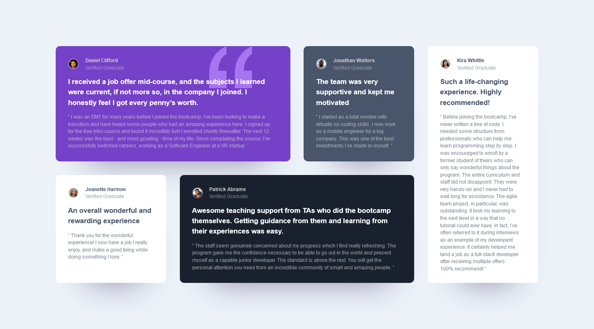

# Frontend Mentor - Testimonials grid section solution

This is a solution to the [Testimonials grid section challenge on Frontend Mentor](https://www.frontendmentor.io/challenges/testimonials-grid-section-Nnw6J7Un7). Frontend Mentor challenges help you improve your coding skills by building realistic projects. 

## Table of contents

- [Overview](#overview)
  - [The challenge](#the-challenge)
  - [Screenshot](#screenshot)
  - [Links](#links)
- [My process](#my-process)
  - [Built with](#built-with)
- [Author](#author)

## Overview

### The challenge

Users should be able to:

- View the optimal layout for the site depending on their device's screen size

### Screenshot

<figure style="display: flex; justify-content: space-between">
  
  
</figure>

### Links

- Solution URL: [Github repo](https://github.com/victor-stephen/frontend-mentor/tree/testimonials-grid-section-main)
- Live Site URL: [https://victor-stephen-testimonials-grid.netlify.app/](https://victor-stephen-testimonials-grid.netlify.app/)

## My process

### Built with

- Semantic HTML5 markup
- CSS custom properties
- Flexbox
- CSS Grid
- Mobile-first workflow

## Author

- Website - [Victor Stephen](https://victor-stephen.netlify.app/)
- Frontend Mentor - [@victor-stephen](https://www.frontendmentor.io/profile/victor-stephen)
- Twitter - [@victorstephenc](https://www.twitter.com/victorstephenc)